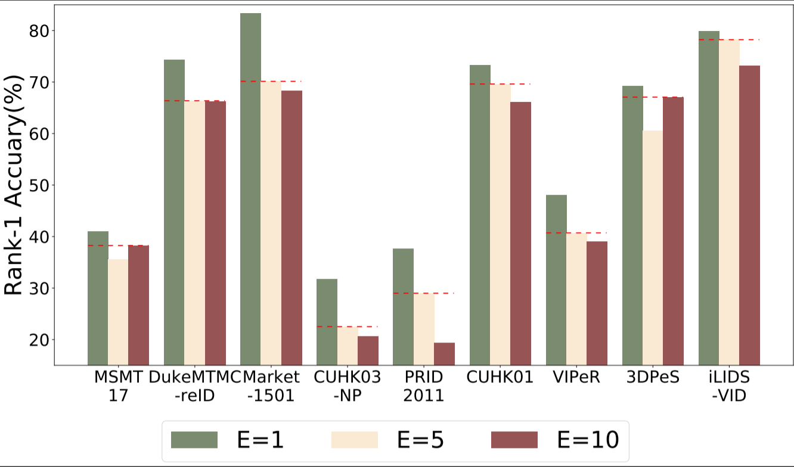

# Experiments

## Plot Result Curves/Bar Plots

These scripts read your training log file:

* Plot Rank-1/mAP versus Epochs on some Collection of Datasets: 
    ```
    python plot_Rank1_mAP_curve.py --log_file_path --save_fig_path
    ```

* Bar-Plot Rank-1/mAP of Best Fed-Model on All Datasets ("Best" is defined as the Average Performance of Top-3 Fed-Models on Big-Datasets): 
    ```
    python plot_Rank1_mAP_bar.py --log_file_path --save_fig_path
    ```

* Bar-Plot Comparsion of Rank-1 Accuracy with Different Local-Epochs(i.e. E=1,E=5,E=10)  
You need to Provide all Log Files!  
One can Use this script to Do Comparison with Different Batch Sizes as well. 
    ```
    python plot_Rank1_versus_local_epoch.py --log_file1_path --log_file2_path --log_file3_path --save_fig_path
    ```
**Bar Plots of Best Fed-Models within 300 rounds:**

